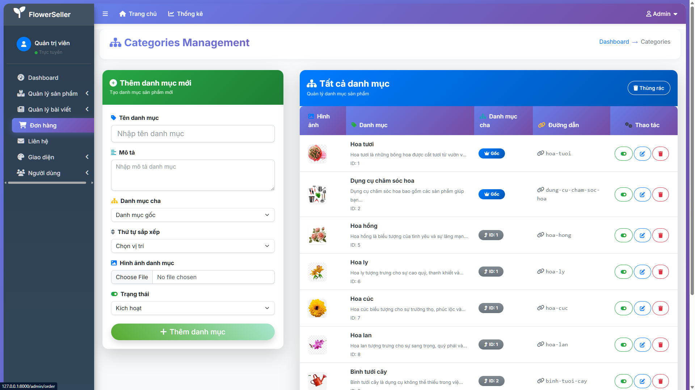

# FlowerSeller - Hệ Thống Quản Lý & Bán Hoa Trực Tuyến
# Sinh viên thực hiện: Phạm Như Thuật / MSSV: 22010498

## 1. Giới thiệu dự án

FlowerSeller là hệ thống thương mại điện tử chuyên về bán hoa, được xây dựng trên nền tảng PHP Laravel, hướng tới trải nghiệm người dùng hiện đại, thân thiện và tối ưu cho cả khách hàng lẫn quản trị viên. Dự án đáp ứng các yêu cầu thực tế về quản lý sản phẩm, đơn hàng, thương hiệu, chủ đề, bài viết, menu, đồng thời đảm bảo bảo mật, hiệu năng và khả năng mở rộng.

## 2. Kiến trúc & Công nghệ

- **Backend:** PHP Laravel (MVC), Eloquent ORM, MySQL
- **Frontend:** Blade Template, HTML5, CSS3 (Flexbox, Grid), Responsive UI, Badge, Icon, Animation
- **Công cụ hỗ trợ:** Composer, Laravel Artisan, Vite
- **Quản lý phiên bản:** Git

## 3. Cơ sở dữ liệu & Mô hình dữ liệu

- **Bảng chính:**
  - `users`: Người dùng hệ thống
  - `products`: Sản phẩm hoa
  - `orders`: Đơn hàng
  - `order_details`: Chi tiết đơn hàng
  - `categories`, `brands`, `banners`, `contacts`, `menus`, `posts`, `topics`

## 4. Chức năng hệ thống

### 4.1. Khách hàng
- Xem danh mục, chi tiết sản phẩm, lọc theo loại, giá
- Thêm vào giỏ hàng, đặt hàng, đăng ký/đăng nhập
- Xem lịch sử đơn hàng, thông tin liên hệ

### 4.2. Quản trị viên (Admin)
- Quản lý sản phẩm, danh mục, thương hiệu, chủ đề, bài viết, banner, menu
- Quản lý đơn hàng: xem, cập nhật, thống kê, xuất dữ liệu
- Quản lý người dùng, liên hệ
- Giao diện quản trị hiện đại, responsive, đồng bộ tiếng Việt, badge, icon, animation

## 5. Giao diện hệ thống
Dưới đây là một số ảnh chụp giao diện hệ thống FlowerSeller sau khi hiện đại hóa và đồng bộ UI/UX:

### Trang quản trị danh mục sản phẩm


### Trang quản trị thương hiệu


### Trang quản trị bài viết


### Trang quản trị chủ đề


### Trang quản lý đơn hàng


### Trang quản lý menu


> *Lưu ý: Đường dẫn ảnh chỉ là ví dụ, bạn hãy thay bằng ảnh chụp thực tế của hệ thống tại thư mục `public/images/screenshots/`.*

## 6. Bảo mật & Xử lý dữ liệu

- **Validation:** Sử dụng validation Laravel cho mọi form (đăng ký, đăng nhập, đặt hàng, quản trị)
- **XSS/SQL Injection:** Escape dữ liệu, kiểm tra đầu vào, sử dụng Eloquent ORM
- **Quyền truy cập:** Phân quyền rõ ràng giữa khách và admin
- **Xử lý lỗi:** Thông báo rõ ràng, log lỗi hệ thống

## 7. Hướng dẫn cài đặt & sử dụng

1. **Yêu cầu:** PHP >= 8.x, Composer, MySQL
2. **Clone dự án:**
   ```bash
   git clone <repo-url>
   cd FlowerSeller
   ```
3. **Cài đặt package:**
   ```bash
   composer install
   npm install && npm run build
   ```
4. **Cấu hình môi trường:**
   - Copy `.env.example` thành `.env`, chỉnh sửa thông tin DB
   - Tạo database, chạy migration & seed:
     ```bash
     php artisan migrate --seed
     ```
5. **Khởi động server:**
   ```bash
   php artisan serve
   ```
6. **Truy cập:**
   - Trang khách: http://localhost:8000
   - Trang admin: http://localhost:8000/admin (tài khoản mẫu trong seed hoặc tạo mới)